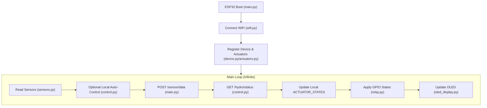

<<<<<<< HEAD
# ESP32 MicroPython - Hydroponics Controller

This folder contains the MicroPython source code for the ESP32 controller that manages sensors and actuators in the hydroponic system.

## Folder Structure

- **`main.py`**: Entry point of the application. Handles the main loop, network stability, and coordination between modules.
- **`config.py`**: Centralized configuration (WiFi credentials, Backend URLs, Auth Tokens, and global state).
- **`sensors.py`**: Logic for reading sensors (DHT11 for Temp/Hum, Analog EC/PPM sensors).
- **`relay.py`**: Hardware abstraction for relays (Active Low logic). Manages GPIO pins and safety timeouts.
- **`control.py`**: Logic for fetching commands from the backend and local auto-control (if enabled).
- **`wifi.py`**: Manages WiFi connection and reconnection.
- **`device.py` / `device_id.py`**: Device identification and registration with the FastAPI backend.
- **`actuators.py`**: Registration of local actuators (Pump, Fan, Light) to the backend.
- **`oled_display.py` / `ssd1306.py`**: Drivers and logic for the local I2C OLED display status.

## System Flow

## Data Integration

1.  **Sensor Upload**: Every `SEND_INTERVAL` (default 10s), the ESP32 sends a JSON payload to the FastAPI `/sensor/data` endpoint.
2.  **Command Polling**: After sending data, the ESP32 calls `/hydro/status` to receive the latest desired state for its actuators (determined by backend rules or manual overrides).
3.  **Safety**: `relay.py` includes a `MAX_ON_TIME` safety feature to prevent actuators (like the pump) from running indefinitely if a "turn off" command is missed.

## Pin Mapping (Default)

| Component | ESP32 Pin | Logic |
| :--- | :--- | :--- |
| **DHT11 (Temp/Hum)** | GPIO 15 | Data |
| **EC Sensor** | GPIO 34 | Analog |
| **Pump Relay** | GPIO 26 | Active LOW |
| **Fan Relay** | GPIO 27 | Active LOW |
| **Light Relay** | GPIO 14 | Active LOW |
| **Water Pump Relay** | GPIO 12 | Active LOW |
| **OLED (SDA/SCL)** | GPIO 21 / 22 | I2C |
=======
# HydroNode
HydroNode is an ESP32-based firmware for smart hydroponic automation, enabling real-time monitoring, sensor data collection, and automated control of pumps, lights, and other devices.
>>>>>>> c2d21ac998cf14826282f3a08d247a5f868c9cd8
