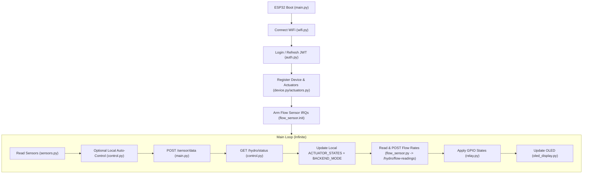

# HydroNode — ESP32 MicroPython Hydroponics Controller

HydroNode is an ESP32-based firmware for smart hydroponic automation, enabling real-time monitoring, sensor data collection, and automated control of pumps, lights, and other devices.

This folder contains the MicroPython source code for the ESP32 controller that manages sensors and actuators in the hydroponic system.

## Folder Structure

- **`main.py`**: Entry point of the application. Handles the main loop, network stability, and coordination between modules.
- **`config.py`**: Centralized configuration (WiFi credentials, backend URLs, GPIO mapping, and global runtime state).
- **`secrets.py`** *(gitignored, not included)*: Auth credentials (`AUTH_USERNAME`, `AUTH_PASSWORD`) imported by `config.py`.
- **`auth.py`**: Logs in to the backend at boot (and on 401) to obtain a fresh JWT, so the firmware never relies on a static token that can expire or be invalidated by a DB wipe.
- **`sensors.py`**: Logic for reading sensors — DHT11 (temp/humidity), analog EC/PPM, and the analog rain sensor.
- **`flow_sensor.py`**: Pulse-counting flow rate support (YF-S201/YF-B1 style) for water actuators, keyed off `config.FLOW_SENSOR_PINS`. Uses GPIO interrupts, so sensors must be wired to a native ESP32 pin (not an MCP23017 expander pin).
- **`relay.py`**: Hardware abstraction for relays and the PWM/mosfet-driven water pump (active-low relay logic). Manages GPIO pins and the `MAX_ON_TIME` safety timeout.
- **`control.py`**: Logic for fetching commands from the backend and local auto-control (if `AUTO_MODE` is enabled), including a local rain-safety override. Also derives the backend-reported display mode (`config.BACKEND_MODE`) shown on the OLED.
- **`wifi.py`**: Manages WiFi connection, reconnection, and connectivity diagnostics (gateway/backend reachability tests).
- **`device.py` / `device_id.py`**: Device identification (derived from the ESP32's MAC address) and registration with the FastAPI backend.
- **`actuators.py`**: Registration of local actuators (Pump, Fan, Light, Water Pump, Valve) with the backend, and population of `config.ACTUATOR_IDS` (type → backend numeric id) needed to tag outgoing flow readings.
- **`oled_display.py` / `ssd1306.py`**: Driver and logic for the local I2C OLED status display.
- **`helper.py`**: Shared logging (`log`, `pretty`) and an HTTP request wrapper that enforces a socket timeout.

## System Flow



## Data Integration

1. **Sensor Upload**: Every `SEND_INTERVAL` (default 10s), the ESP32 sends a JSON payload to the FastAPI `/sensor/data` endpoint, including temperature, humidity, EC/PPM, and rain (`rain_detected` / `rain_intensity`), each paired with a `*_valid` flag.
2. **Command Polling**: After sending data, the ESP32 calls `/hydro/status` to receive the latest desired state for its actuators (determined by backend rules or manual overrides).
3. **Flow Rate Upload**: Immediately after command polling, `flow_sensor.read_all()` reports L/min for each armed sensor since the previous read. For each reading, `main.py` looks up the actuator's backend numeric id via `config.ACTUATOR_IDS[actuator_type]` and `POST`s `{actuator_id, device_id, flow_rate}` to `/hydro/flow-readings`. If an actuator type has no known id yet (e.g. registration hasn't completed), that reading is skipped with a warning rather than posted with a bad/missing id.
4. **Mode Sync (Display Only)**: `control.py::check_commands()` also derives `config.BACKEND_MODE["mode"]` from the same `/hydro/status` payload, so the OLED reflects what the *backend* thinks each actuator is doing rather than a stale local flag:
   - For each **active** actuator, a non-null `manual_state` (`true`/`false`) always means that actuator is under an active **manual override**, regardless of what its `mode` string says (the backend may report `"manual_on"`/`"manual_off"` in that case). Only when `manual_state` is `null` is the actuator's own `mode` field (normally `"auto"`) trusted.
   - If every active actuator resolves to `"auto"` → `BACKEND_MODE["mode"] = "AUTO"`.
   - If every active actuator resolves to `"manual"` → `BACKEND_MODE["mode"] = "MAN"`.
   - If it's a mix of both → `BACKEND_MODE["mode"] = "MIXED"` (e.g. Water Pump manually forced on while Pump/Fan/Light/Valve remain on backend auto-control).
   - If the actuator list comes back empty (e.g. a transient fetch issue), the last known mode is left unchanged rather than defaulting to `MAN`.
   - This is distinct from `config.AUTO_MODE["enabled"]`, which only governs the ESP32's **local** fallback control logic (`control.py::auto_control()`, currently disabled in `main.py`) and is unrelated to what the backend displays.
5. **Safety**:
   - `relay.py` includes a `MAX_ON_TIME` safety feature to prevent actuators (like the pump) from running indefinitely if a "turn off" command is missed.
   - `control.py`'s local `auto_control()` forces the pump, water pump, and valve OFF whenever a valid rain reading is detected — a local fallback for the backend's `rain_detected_action` rule in case connectivity is lost.
   - Auth tokens are minted fresh at boot (`auth.py`) rather than baked into the firmware, so a backend DB wipe or 30-day token expiry doesn't require a reflash — only recreating the same username/password on the backend.

## Flow Sensors (`flow_sensor.py`)

Pulse-counting flow rate support for YF-S201/YF-B1-style sensors, one per actuator type listed in `config.FLOW_SENSOR_PINS` (currently just `water_pump`, GPIO 4).

- **Arming**: `flow_sensor.init()` runs once at boot (after actuator registration, before the main loop). For each configured sensor it attaches a rising-edge IRQ (`Pin.IRQ_RISING`) that increments an in-memory pulse counter. The `Pin` object is kept alive in a module-level dict so the IRQ handler isn't garbage-collected.
- **Native GPIO only**: A descriptor starting with `"mcp:"` (an MCP23017 I/O-expander pin) is refused with a warning and skipped — expander pins in this firmware are polled, not interrupt-capable, so they'd silently never count pulses. Flow sensors must be wired to a native ESP32 GPIO.
- **Reading**: `flow_sensor.read_all()` is called once per `SEND_INTERVAL` cycle (right after `check_commands()`). For each armed sensor it computes:

  ```
  flow_rate (L/min) = (pulses_since_last_read / pulses_per_liter) / (seconds_since_last_read / 60)
  ```

  and resets that sensor's pulse counter, so the returned rate always covers the interval since the *previous* call — this only makes sense on a steady polling cadence, not called ad hoc.
- **Calibration**: `config.FLOW_CALIBRATION` maps actuator type → pulses-per-liter (YF-S201 ≈ 450 P/L per datasheet); calibrate per physical sensor for accurate L/min.
- **Kill switch**: `config.FLOW_SENSOR_ENABLED = False` disables `init()` and makes `read_all()` return `{}` immediately, with no GPIO/IRQ side effects — useful for boards with no flow sensor wired.
- **Upload**: readings are posted to `/hydro/flow-readings` from `main.py` (see Data Integration above), tagged with the actuator's backend id via `config.ACTUATOR_IDS`. `session_id` is intentionally omitted (nullable — no active irrigation session tracking yet).

## Actuator ID Mapping (`config.ACTUATOR_IDS`)

A runtime dict, `{actuator_type: backend_numeric_id}` (e.g. `{"water_pump": 4}`), populated entirely by `actuators.py::register_actuators()` at boot:

1. It first `GET`s the device's existing actuators from the backend and seeds `ACTUATOR_IDS` from whatever's already registered (so a reboot doesn't lose the mapping or re-create actuators).
2. Any actuator type not yet on the backend is bulk-registered via `POST /actuators/bulk`; the created objects returned by that call (each with `id` and `type`) are used to fill in the remaining `ACTUATOR_IDS` entries.
3. The final map is printed at boot for visibility (`[✓] Actuator ID map: ...`).

This id is required for flow-rate uploads (`/hydro/flow-readings` expects a numeric `actuator_id`, not a GPIO pin or type string). If `main.py` ever needs to post a flow reading for a type missing from `ACTUATOR_IDS`, it logs a warning and skips that reading rather than sending a malformed payload — check that actuator registration succeeded if you see that warning repeatedly.

## Pin Mapping (Actual — matches `config.py` / `sensors.py` / `flow_sensor.py`)

| Component | ESP32 Pin | Logic |
| :--- | :--- | :--- |
| **DHT11 (Temp/Hum)** | GPIO 14 | Digital |
| **EC Sensor** | GPIO 34 | Analog |
| **Rain Sensor** | GPIO 35 | Analog |
| **Pump Relay** | GPIO 25 | Active LOW |
| **Fan Relay** | GPIO 23 | Active LOW |
| **Light Relay** | GPIO 27 | Active LOW |
| **Water Pump** | GPIO 16 | PWM / Mosfet |
| **Water Pump Flow Sensor** | GPIO 4 | Digital pulse (interrupt), native GPIO required |
| **Valve Relay** | GPIO 18 | Active LOW |
| **OLED (SDA/SCL)** | GPIO 21 / 22 | I2C |

> ⚠️ GPIO pins are defined centrally in `config.TYPE_TO_GPIO` / `config.TYPE_TO_HARDWARE` (actuators) and `config.FLOW_SENSOR_PINS` (flow sensors). If you rewire a component, update `config.py` — this table should always match it.

## Runtime State Reference (`config.py`)

| State | Set By | Read By | Purpose |
| :--- | :--- | :--- | :--- |
| `ACTUATOR_STATES` | `control.py::check_commands()` | `relay.py::update_relays()`, `oled_display.py` | Per-GPIO ON/OFF, authoritative for driving relays. |
| `PUMP_SPEED` | `control.py::check_commands()` | `relay.py::update_relays()` | PWM duty (%) for mosfet-driven actuators (e.g. water pump). |
| `ACTUATOR_IDS` | `actuators.py::register_actuators()` | `main.py` (flow-reading upload) | Maps actuator type → backend numeric id, needed to tag `/hydro/flow-readings` payloads. |
| `AUTO_MODE` | Static in `config.py` (currently never changed) | `main.py` (call site commented out) | Would enable/disable **local** fallback auto-control; not currently active. |
| `BACKEND_MODE` | `control.py::check_commands()` | `oled_display.py` | Display-only summary (`AUTO` / `MAN` / `MIXED`) of what the **backend** reports per-actuator; reflects real manual overrides via `manual_state`. |
